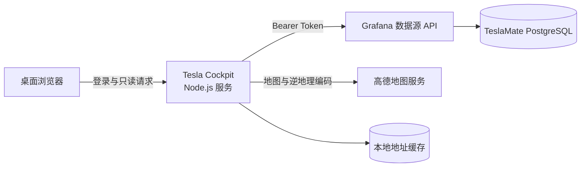

# Tesla Cockpit

一个面向桌面端的只读 TeslaMate 数据驾驶舱。它通过本地 Node.js 服务访问 Grafana 数据源 API，将车辆概览、行程、充电、能耗、电池与状态数据整理为独立网页，不受 Grafana 页面布局影响。

本项目基于 [wjsall/teslamate-chinese-dashboards](https://github.com/wjsall/teslamate-chinese-dashboards) 所提供的 TeslaMate 中文化使用经验、数据环境与国内地图实践进行定制开发。感谢该项目及 [TeslaMate](https://github.com/teslamate-org/teslamate) 社区的工作。

> 本项目不是 Tesla、TeslaMate 或上述仪表盘项目的官方产品。它不连接 Tesla 账户，也不向车辆发送控制指令。

## 界面预览

以下截图已对车辆名称、位置、路线和活动时间进行匿名化处理。

<details open>
<summary><strong>车辆主页</strong></summary>


</details>

<details>
<summary><strong>功能导航</strong></summary>


</details>

<details>
<summary><strong>行程详情</strong></summary>


</details>

<details>
<summary><strong>充电详情</strong></summary>


</details>

<details>
<summary><strong>车辆状态</strong></summary>


</details>

<details>
<summary><strong>统计详情</strong></summary>


</details>

## 功能

- **车辆主页**：车辆状态、电量、额定续航、里程表、平均能耗和今日行驶汇总。
- **能耗趋势**：最近 100 km 的滚动平均能耗，支持纯消耗与净能耗视图、动态纵轴和悬停读数。
- **行程记录**：按时间范围查看里程、时长、平均能耗、路线和起终点中文地址。
- **充电记录**：查看补充电量、充电时长、平均/峰值功率以及单次充电曲线。
- **电池信息**：查看电量、续航和停车掉电等只读统计。
- **车辆状态**：查看在线、休眠、离线等状态分布与时间线。
- **统计汇总**：按今天、最近 7 天、最近 30 天、本月、本年或自定义时间汇总数据。
- **地图与地址**：使用高德地图展示当前位置和行程路线，通过逆地理编码生成中文地点名称。
- **访问保护**：PBKDF2-SHA256 密码哈希、签名会话 Cookie 和页面登录保护。

当前版本按单车、桌面大屏和只读场景设计，不包含车辆控制、充电费用、胎压、电池健康度、多车对比或数据导出。

## 工作方式



Grafana Token、高德 Key 和密码哈希只保存在运行服务的机器上。浏览器只访问 Tesla Cockpit 自己的接口，不会直接拿到这些凭据。

## 环境要求

- Node.js 18 或更高版本
- 已正常运行的 TeslaMate 和 Grafana
- Grafana 中已配置 TeslaMate PostgreSQL 数据源
- 可查询该数据源的 Grafana 服务账户 Token
- 运行 Cockpit 的机器能够访问 Grafana
- 桌面端现代浏览器（Chrome、Edge 等）

Cockpit 可以与 TeslaMate/Grafana 部署在同一台机器，也可以部署在同一局域网内的另一台机器上。

## 快速开始

1. 克隆仓库并进入目录：

```powershell
git clone https://github.com/maruk0Z/tesla-cockpit.git
cd tesla-cockpit
```

2. 创建本地配置：

```powershell
Copy-Item config.example.json config.json
```

3. 编辑 `config.json`，至少填写 Grafana 地址、服务账户 Token 和数据源 UID。

4. 生成登录密码哈希和随机会话密钥：

```powershell
.\set-site-password.ps1
```

5. 启动服务：

```powershell
npm start
```

6. 在浏览器中打开 `http://服务器地址:3456`。

项目当前只使用 Node.js 内置模块，不需要额外安装 npm 依赖。

## 配置说明

| 配置项 | 必填 | 说明 |
| --- | --- | --- |
| `grafanaUrl` | 是 | Grafana 根地址，例如 `http://127.0.0.1:3000` |
| `grafanaToken` | 是 | 仅授予所需数据源读取权限的服务账户 Token |
| `datasourceUid` | 是 | TeslaMate PostgreSQL 数据源的 Grafana UID |
| `datasourceType` | 是 | 默认使用 `grafana-postgresql-datasource` |
| `amapWebServiceKey` | 否 | 高德开放平台“Web 服务”类型 Key，用于逆地理编码 |
| `sitePasswordHash` | 是 | 由 `set-site-password.ps1` 生成的 PBKDF2 密码哈希 |
| `sessionSecret` | 是 | 用于签名登录会话，应使用随机长字符串 |
| `cookieSecure` | 否 | HTTPS 部署时设为 `true`，纯 HTTP 局域网部署保持 `false` |

`config.json`、`address-cache.json` 和日志文件均已被 `.gitignore` 排除。不要把真实 Token、Key、密码哈希、会话密钥或地址缓存提交到 Git。

### 获取 Grafana 配置

1. 在 Grafana 中创建只读服务账户，并生成服务账户 Token。
2. 打开 TeslaMate PostgreSQL 数据源，复制其 UID。
3. 确认服务账户能够通过 Grafana 数据源 API 查询该数据源。
4. 将 Grafana 地址、Token 和 UID 写入 `config.json`。

建议为 Cockpit 单独创建服务账户，并只授予完成查询所需的最低权限。

### 中文地点名称

填写 `amapWebServiceKey` 后，服务端会把车辆位置、行程起终点和充电地点的经纬度发送给高德逆地理编码 API。查询结果会写入本机 `address-cache.json`，后续优先读取缓存，减少重复请求和页面等待时间。

不配置该 Key 时，车辆数据仍可读取，但依赖逆地理编码的中文地点名称可能无法显示。

## 运行与维护

### 直接启动

```powershell
npm start
```

默认监听 `0.0.0.0:3456`。可通过环境变量修改端口：

```powershell
$env:PORT = 8080
npm start
```

### Windows 常驻运行

双击 `start.cmd` 可启动服务。该脚本会在 Node.js 进程退出后等待 10 秒并自动重启，同时将输出写入：

- `tesla-cockpit.log`
- `tesla-cockpit.err.log`

可在 Windows 任务计划程序中创建名为 `TeslaCockpitAutoStart` 的任务，将操作指向项目目录中的 `start.cmd`，并设置为系统启动时运行。已有该任务时，可运行以下脚本重启服务：

```powershell
.\restart-remote.ps1
```

### 修改登录密码

```powershell
.\set-site-password.ps1
```

脚本会更新 `config.json` 中的密码哈希；重启服务后生效。现有登录会话会因密码指纹变化而失效。

### 刷新与缓存

- 车辆在线或活动时，主页数据约每 30 秒刷新。
- 车辆休眠时，主页数据约每 5 分钟刷新。
- 浏览器页面隐藏时会暂停不必要的刷新，重新可见后再同步数据。
- 行程路线、充电曲线和地址结果会按用途缓存，降低 Grafana 与高德 API 压力。
- 页面右上角的刷新按钮可强制重新读取数据。

## 安全与隐私

- 服务只读取 Grafana 数据，不登录 Tesla 账户，也不执行车辆控制。
- 登录密码不以明文保存；会话 Cookie 使用 `HttpOnly` 和 `SameSite=Lax`。
- 通过 HTTPS 反向代理公开服务时，应把 `cookieSecure` 设为 `true`。
- 页面包含实时位置、历史路线、充电地点和活动时间，不建议直接暴露到公网。
- 高德逆地理编码会接收地点经纬度；使用该功能即意味着相关坐标会发送给高德。
- 对外分享截图前，应隐藏车辆名称、地图、地址、路线、时间、经纬度和里程等可识别信息。

## 常见问题

### 页面显示 `No data`

检查 `grafanaUrl`、`grafanaToken` 和 `datasourceUid` 是否正确，并确认服务账户有权查询 TeslaMate PostgreSQL 数据源。Token 应由服务端使用，不要把带凭据的 Grafana URL 放进浏览器页面。

### 页面无法打开

确认 Node.js 进程仍在运行、3456 端口正在监听，并检查 `tesla-cockpit.err.log`。如果使用任务计划程序，也要确认任务的工作目录和运行账户正确。

### 中文地点加载较慢或不显示

确认 `amapWebServiceKey` 是“Web 服务”类型，且高德配额与安全设置允许当前服务器调用。首次查询需要访问高德，命中 `address-cache.json` 后会更快。

### 地图尺寸偶尔异常

刷新页面或重新进入对应视图。地图会在视图可见后重新计算尺寸，并恢复该模块的默认缩放范围。

### 修改配置后没有生效

重启 Node.js 服务。使用任务计划程序时可运行 `.\restart-remote.ps1`。

## 项目关系与许可

- [wjsall/teslamate-chinese-dashboards](https://github.com/wjsall/teslamate-chinese-dashboards)：本项目的上游参考与基础，提供 TeslaMate 中文仪表盘、国内地图适配和相关实践。
- [TeslaMate](https://github.com/teslamate-org/teslamate)：车辆数据采集、存储与 Grafana 数据环境。
- [Grafana](https://grafana.com/)：Cockpit 读取数据所经过的数据源 API。
- [高德开放平台](https://lbs.amap.com/)：地图展示与中文逆地理编码。

使用或分发上游项目及其组件时，请遵循各自的许可证。Tesla、Model S 及相关标识归其权利人所有。
