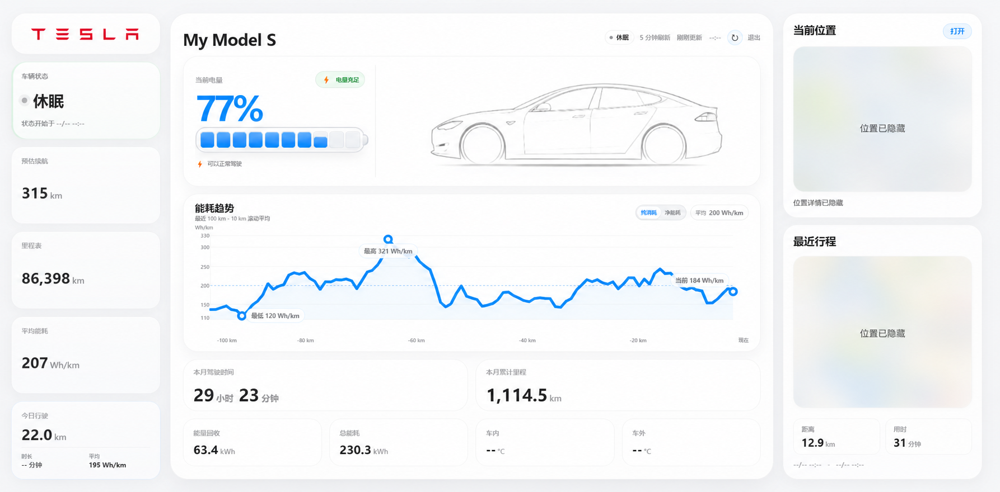
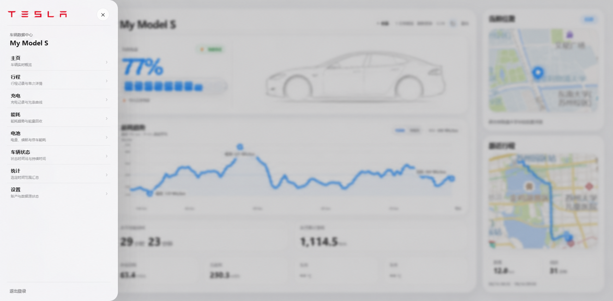
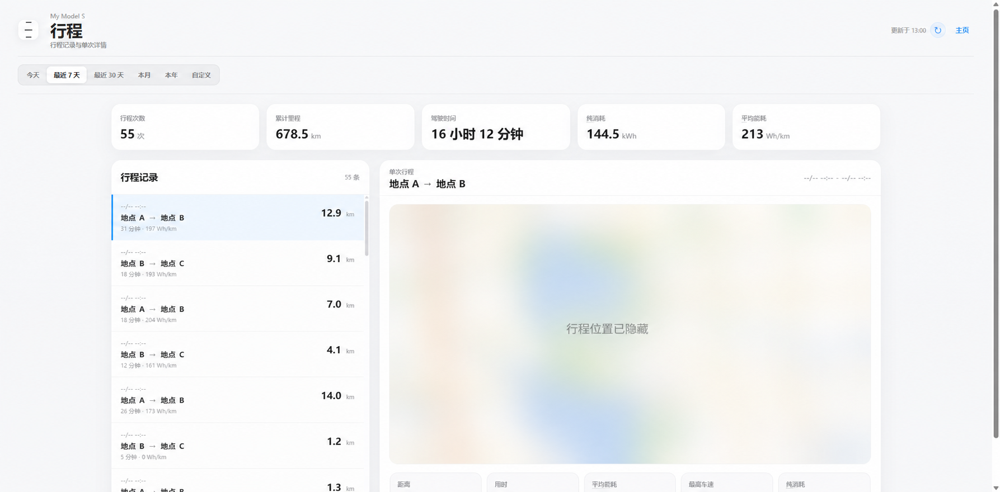
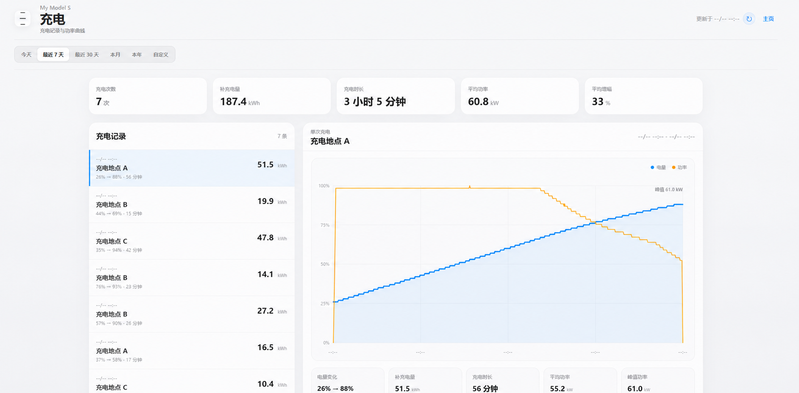
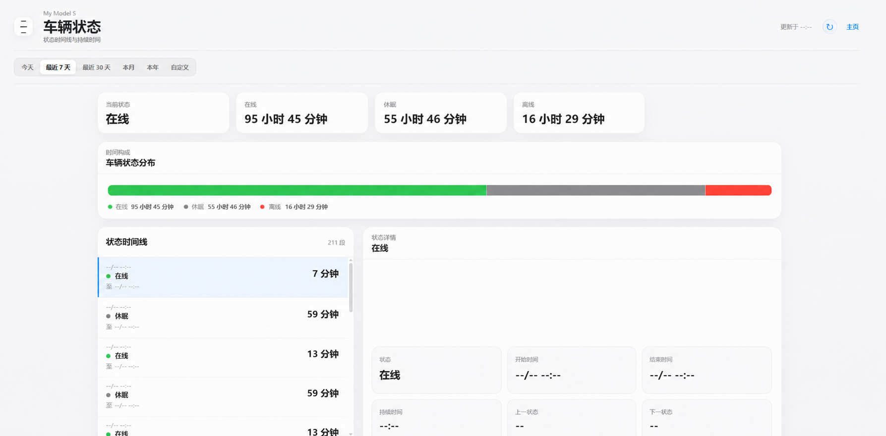
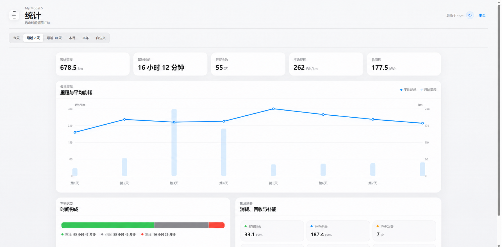

# Tesla Cockpit

一个面向桌面端的只读 TeslaMate 数据驾驶舱。页面通过本地 Node.js 服务访问 Grafana 数据源 API，提供车辆概览、行程、充电、能耗、电池、车辆状态和统计视图。

## 特性

- Apple 风格的桌面驾驶舱界面
- 车辆状态、电量、续航、位置与最近行程
- 最近 100 km 滚动平均能耗趋势
- 行程、充电、电池、状态和统计详情页
- 高德地图路线与逆地理编码
- 登录保护、密码哈希和会话管理
- 在线时 30 秒刷新，休眠时 5 分钟刷新
- 仅通过 Grafana 服务账户读取数据，不控制车辆

## 界面预览

以下截图已对车辆名称、位置、路线和活动时间进行匿名化处理。

<details open>
<summary><strong>车辆主页</strong></summary>



</details>

<details>
<summary><strong>功能导航</strong></summary>



</details>

<details>
<summary><strong>行程详情</strong></summary>



</details>

<details>
<summary><strong>充电详情</strong></summary>



</details>

<details>
<summary><strong>车辆状态</strong></summary>



</details>

<details>
<summary><strong>统计详情</strong></summary>



</details>

## 环境要求

- Node.js 18 或更高版本
- 已运行的 TeslaMate 和 Grafana
- 可读取 TeslaMate PostgreSQL 数据源的 Grafana 服务账户 Token
- 运行 Cockpit 的机器能够访问 Grafana

## 配置

1. 将 `config.example.json` 复制为 `config.json`。
2. 填写 `grafanaUrl`、`grafanaToken` 和 `datasourceUid`。
3. 如需中文地点名称，填写高德开放平台的 `amapWebServiceKey`（Key 类型必须为“Web 服务”）。行程起终点和充电地点经纬度会发送给高德逆地理编码，并持久化缓存在服务器的 `address-cache.json` 中。
4. 运行改密脚本生成 PBKDF2 密码哈希和随机会话密钥：

```powershell
.\set-site-password.ps1
```

`config.json` 包含凭据，已被 `.gitignore` 排除，请勿提交。

## 运行

```powershell
npm start
```

默认监听 `0.0.0.0:3456`。可以通过环境变量修改端口：

```powershell
$env:PORT = 3456
npm start
```

也可以在 Windows 上双击 `start.cmd`。它会在进程退出后自动重启，并轮转日志文件。

## Windows 开机启动

可使用 Windows 任务计划程序创建任务，并把操作指向项目目录中的 `start.cmd`。`restart-remote.ps1` 可用于重启名为 `TeslaCockpitAutoStart` 的现有任务。

## 安全说明

- 仓库不会包含真实 Grafana Token、站点密码哈希或会话密钥。
- 建议只在可信的局域网中提供服务，或在前面配置 HTTPS 反向代理。
- Grafana 服务账户应只授予读取所需数据源的最低权限。
- 页面包含车辆位置和行程信息，请保持仓库及运行环境的访问权限受控。
